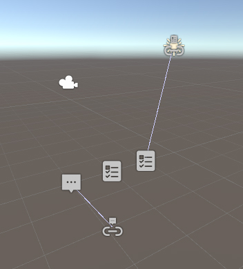
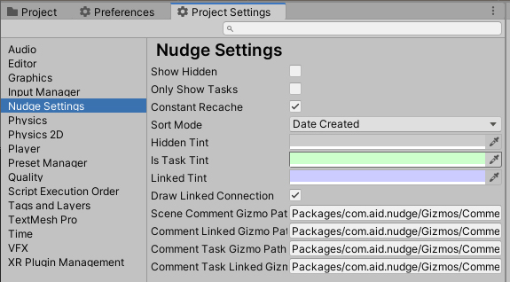
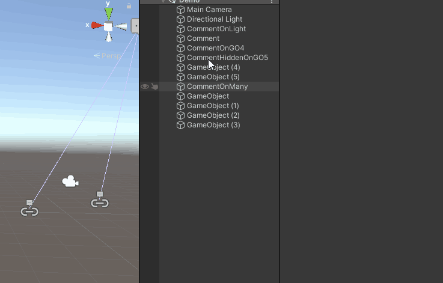
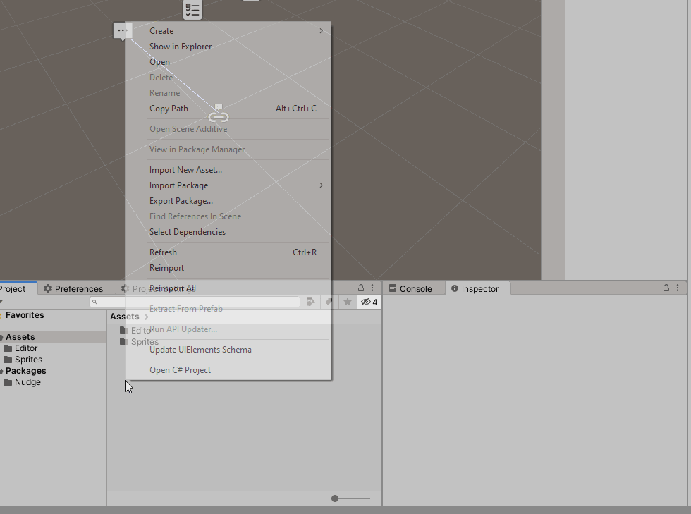
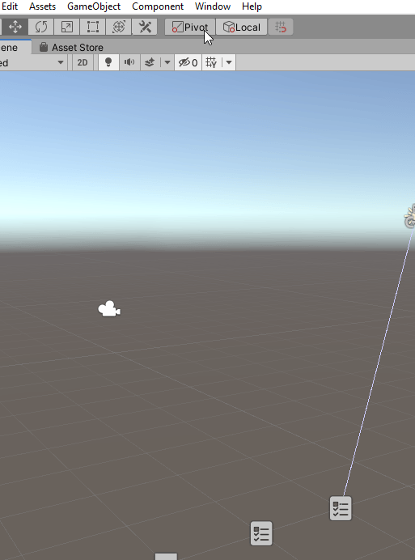

# 

Adding comments, and todos, in code is simple, easy, and invaluable for feedback, reminders, and async communication. Nudge seeks to replicate some of that value with in Unity itself. Sometimes all you need is a little nudge in the right direction.

## Why?

I wanted to be able to put comments and todos on prefabs, scenes, gameobjects, and assets in Unity projects. We use a comment as a component or a comment scriptable object as an asset. These can reference a specific UnityEngine.Object and contain a body of the comment along with other useful info for sorting and tracking the comment as it is used or processed by yourself or others.

## Features

- Put comments directly in the Unity project, either in scenes or on prefabs
- Put comments anywhere in your project folder, with optional referencet to other assets.
- Automatically name and link target of newly created comments based on currently selected objects.
- Window to show, locate, and sort all comments in the current scene(s) and within the project.
- Customise colour tints via Project Settings->Nudge Settings.

## How do I use this?

- Add Nudge to your package manager with Add Git 'https://github.com/SAM-tak/Nudge.git#upm'
  - If Unity reports it is unable to find git, you don't have a system install of git setup, try 'https://git-scm.com/download/win'. You will need to close and re open Unity and Unity Hub after git is installed.
- Add Comments to GameObjects within scenes so they can live on, or make reference to, other scene objects.
  - Via GameObject menu, rightlick.

- Add/Create a CommentSO to denote comments regarding the project in general or specific assets.
  - Via Create menu, rightlick.

- Open Window->Tasks and Comments to see all comments in the scene and project.

## Contributions?

Nudge is still in development and is very open to contributions! Bugs and feature requests are encouraged in the Issues.
