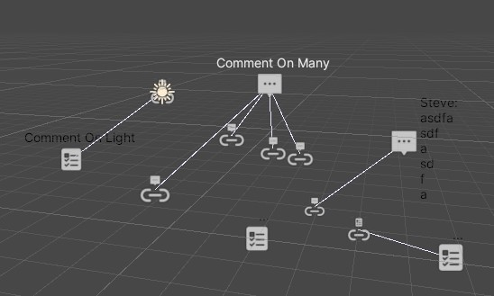

# Nudge
Adding comments and todos in your code is simple and invaluable as a method of documentation, feedback, and async communication. Nudge seeks to extend some of this value to elements of Unity itself. It's small thing, but sometimes a little nudge has a lot of worth.

## Why?
I wanted to be able to put comments and todos on prefabs, scenes, gameobjects, and assets in unity projects. We use a comment as a component or a comment scriptable object as an asset. These can reference a specific UnityEngine.Object and contain a body of the comment along with other useful info for sorting and tracking the comment as it is used or processed by yourself or others.

## Features
- Put comments directly in the Unity project, either in scenes or on prefabs
- Put comments in your project folder to reference assets or just generally. 
- Window to show and sort all comments in the current scene(s) and within the project.
- Customise colour tints via Project Settings->Nudge Settings.

How do I use this?
---
- Add Nudge to your package manager with Add Git https://github.com/stevehalliwell/Nudge.git#upm
- Add CommentBeh to GameObjects within scenes so they can live on or reference scene objects

- Add CommentSO to denote comments regarding project assets.

- Open Window->Tasks and Comments to see all comments in the scene and project

Contributions?
---
Nudge is still in development and is very open to contributions, bugs and feature requests encouraged in the Issues.

